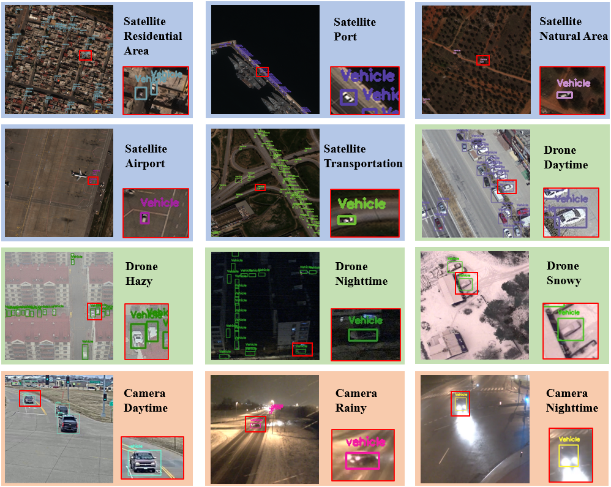

# LMLNet: Language-Guided Manifold Learning for Cross-Domain Remote Sensing Object Detection

This repository provides the official implementation of **LMLNet**, a Language-Guided Manifold Learning Network for cross-domain remote sensing object detection under the **Single-Domain Generalized Object Detection (SDGOD)** setting.

## News

- **2026-06-15**: Paper submitted.
- **2026-06-15**: The project code and dataset samples have been uploaded to GitHub.
- **2026-06-15**: The project code and dataset samples are available at the links below:
  - **Dataset samples**: [Baidu Netdisk](https://pan.baidu.com/s/1FqOWmFqRQidiZAInV6SHOA?pwd=m3vl)
  - **Project code**: [Baidu Netdisk](https://pan.baidu.com/s/1Ej0QyyX6PqY1-OrVpbcveA?pwd=m3vl)

## Abstract

Cross-domain remote sensing object detection under the SDGOD setting is crucial for deploying detectors in unseen target domains. Existing methods typically perform feature fusion and matching in Euclidean space with a fixed inner-product metric, which may overlook feature geometry and cause biased similarity estimation under domain shift. Moreover, maintaining manifold feasibility across layers remains challenging, and instance-level text is often too short and sparse to provide reliable cross-domain semantic anchors.

To address these issues, we propose **Language-Guided Manifold Learning Network (LMLNet)**, a Vision-Language Model (VLM) framework for cross-domain generalizable object detection in remote sensing. LMLNet introduces **Affine-Invariant Riemannian Metric Calibrated Cross-Attention (AccA)** to model cross-modal feature geometry, **Geometry-Preserving Bilinear Mapping (GPB)** with Stiefel-constrained optimization to preserve geometric feasibility, and **Text Denoising Key-Value (TDKV)** to enhance the robustness of text guidance under weak instance-level semantics.

To the best of our knowledge, we build the first vision-language benchmark for remote sensing SDGOD, where LMLNet achieves state-of-the-art performance.

## Dataset

We construct **M³VL**, a **Multi-Scene, Multi-Weather, Multi-Platform Vision-Language Remote Sensing Dataset** for cross-domain remote sensing object detection. M³VL contains **17,059 images**, **363,554 object instances**, and **1,199 unique words** in textual descriptions.

  

  <b>Figure 1.</b> Representative examples of M³VL, covering satellite, drone, and traffic-camera views under diverse scene, weather, and illumination conditions.

M³VL is built by reorganizing and adapting multiple public datasets:

| Source Dataset | Usage in M³VL |
|---|---|
| xView [1] | Satellite-view object detection |
| DIOR [2] | Satellite-view object detection |
| VME [3] | Satellite-view vehicle detection |
| DroneVehicle [4] | Drone daytime, nighttime, and hazy vehicle detection |
| NVD [5] | Snowy drone vehicle detection |
| AAU RainSnow / AAU Visual Rain Dataset [6] | Traffic-camera rainy scenarios |
| AI City Challenge / CityFlow [7] | Traffic-camera vehicle detection |

Based on these sources, we unify annotation formats, reorganize the data into **12 domain-specific sub-datasets**, and provide textual descriptions covering object categories, visual attributes, and scene semantics.

The 12 sub-datasets cover:

- **Satellite domains**: residential area, port, natural area, airport, and transportation.
- **Drone domains**: daytime, hazy, nighttime, and snowy.
- **Camera domains**: daytime, rainy, and nighttime.

We further define four cross-domain evaluation settings:

- **Cross-illumination**
- **Cross-weather**
- **Cross-scene**
- **Cross-platform**

These settings are designed to reflect practical domain shifts in real-world remote sensing applications.

## References

[1] D. Lam, R. Kuzma, K. McGee, S. Dooley, M. Laielli, M. Klaric, Y. Bulatov, and B. McCord, “xView: Objects in Context in Overhead Imagery,” arXiv:1802.07856, 2018.

[2] K. Li, G. Wan, G. Cheng, L. Meng, and J. Han, “Object Detection in Optical Remote Sensing Images: A Survey and A New Benchmark,” arXiv:1909.00133, 2019.

[3] N. Al-Emadi, I. Weber, Y. Yang, and F. Ofli, “VME: A Satellite Imagery Dataset and Benchmark for Detecting Vehicles in the Middle East and Beyond,” arXiv:2505.22353, 2025.

[4] Y. Sun, B. Cao, P. Zhu, and Q. Hu, “Drone-based RGB-Infrared Cross-Modality Vehicle Detection via Uncertainty-Aware Learning,” arXiv:2003.02437, 2020.

[5] H. Mokayed, A. Nayebiastaneh, K. De, S. Sozos, O. Hagner, and B. Backe, “Nordic Vehicle Dataset (NVD): Performance of Vehicle Detectors Using Newly Captured NVD from UAV in Different Snowy Weather Conditions,” arXiv:2304.14466, 2023.

[6] J. B. Haurum, C. H. Bahnsen, and T. B. Moeslund, “Is it Raining Outside? Detection of Rainfall Using General-Purpose Surveillance Cameras,” arXiv:1908.04034, 2019.

[7] Z. Tang, M. Naphade, M.-Y. Liu, X. Yang, S. Birchfield, S. Wang, R. Kumar, D. Anastasiu, and J.-N. Hwang, “CityFlow: A City-Scale Benchmark for Multi-Target Multi-Camera Vehicle Tracking and Re-Identification,” arXiv:1903.09254, 2019.

## Citation

Citation information will be updated after publication.

## License

The license will be updated before the official release.
